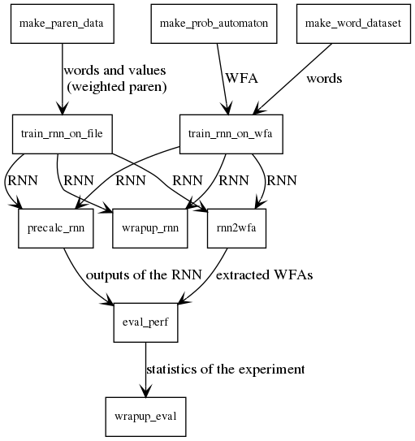

# rnn2wfa_experiment

## What's this?
An implementation of [1].  
If you need the data generated by the code and used in the paper, please contact the author.

[1] Takamasa Okudono, Masaki Waga, Taro Sekiyama and Ichiro Hasuo. Weighted Automata Extraction from Recurrent Neural Networks via Regression on State Spaces. Proc. AAAI 2020, to appear.

## Architecture of the Experiment Ssytem

The experiment system consists of some programs.
All programs are basically made to take required data by zip files, excute the main procedure, and save the result as a zip file (originally it was made to communicate with our S3 bucket, but now modified so that it can run locally.)
- `make_prob_automaon`: generate probabilistic WFA randomly
- `make_paren_data`: generate a list of random words with parenthesis and their score.  About half of the words are made so that their parenthesis match.
- `make_word_dataset`: generate random words consist of the given alphabet
- `train_rnn_on_wfa`: takes a word set and a WFA and learn RNNs.  It is expected to use for WFA2RNN2WFA
- `train_rnn_on_file`: takes a list of words and their weigth and learn RNNs.  It is expected to use for the weighted parenthesis experiment
- `precalc_rnn`: takes an RNN and a word set, run the RNNs for the words and returns the accuracy and the elapsed time
- `rnn2wfa`: take an RNN and runs RNN2WFA procedure
- `wrapup_rnn`: return RNNs and words and returns the CSV table of the accuracy
- `eval_perf`: take a result of `precalc` and an extracted WFA and returns the accuracy and the elapsed time
- `wrapup_eval`: take the results of `eval_perf`, analyze the result and make a CSV table of the statistics


## Requirements
- All needed modules are installed automatically by using Pipenv.
- Graphviz: to run `depict_wfa`

## Usage/Arguments
The filename of output is printed at the end of STDOUT.

### make_prob_automaton
- `alphabets`: alphabet set that the WFA takes
- `n_states`: number of states of the generated WFA
- `degree`: maximum number of outgoing edge for each states.  We recommend `3`.
- `-o`: output filename.  The timestamp is added in front of this.

### make_paren_data
- `alphabet`: alphabet which the generated words consist of 
- `--max_length`: maxmum length of generated words.  We recommend `20`.
- `--num`: number of words.  We recommend `10000`.  10% of them are used for testing and 90% are used for training.
- `--seed`: random seed
- `-o`: output filename.  The timestamp is added in front of this.

### make_word_dataset
- `alphabets`: alphabet which the generated words consist of 
- `n_samples`: number of words.  We recommend `10000`.  10% of them are used for testing and 90% are used for training.
- `--max_length`: maxmum length of generated words.  We recommend `20`.
- `--length_sampling`: way to generate words.  `all_words` just pick randomly from the possible words.  `all_lengths` pick a length from the possible lengths, and pick a word from the possible words of the picked length.  We recommend `all_lengths`.
- `--sorted`: when this is specified, the words are generated from the language shown in Experiment section and used for "realistic" setting.
- `-o`: output filename.  The timestamp is added in front of this.

### train_rnn_on_wfa
- `--embed_dim`: the dimension of the output of the embedding.  `50` is recommended.
- `--hidden_output_dims`: the dimensions of the outputs of the hidden layers.  `50,50` is recommended.
- `--batch_size`: `1` is recommended
- `--n_epochs`: number of epochs
- `--max_length`: maxmum length of generated words.  We recommend `20`.
- `-o`: output filename.  The timestamp is added in front of this.
- `--words`: word set generated by `make_word_dataset`
- `--wfa`: wfa file generated by `make_prob_automaton`

### train_rnn_on_file
- `--embed_dim`: the dimension of the output of the embedding.  `50` is recommended.
- `--hidden_output_dims`: the dimensions of the outputs of the hidden layers.  `50,50` is recommended.
- `--batch_size`: `1` is recommended
- `--n_epochs`: number of epochs
- `--max_length`: maxmum length of generated words.  We recommend `20`.
- `-o`: output filename.  The timestamp is added in front of this.
- `traindata`: words and values generated by `make_paren_data`

### precalc_rnn
- `rnn`: output rnn generated by `train_rnn_on_wfa` or `train_rnn_on_file`
- `--paren`: enable this if the rnn is from `train_rnn_on_file`
- `-o`: output filename.  The timestamp is added in front of this.

### rnn2wfa
- `{regr,sample,search}`: `regr` is our method based on regression.  `search` is BFS-based method.
- `eqq_param`: json file to determine the behavior of Equivalence query
- `rnn`: output rnn generated by `train_rnn_on_wfa` or `train_rnn_on_file`
- `--tol_rank_init`: Initial value of \tau in Algorithm 2 (in extended version)
- `--tol_rank_decay_rate`: r in Algorithm 2 (in extended version)
- `--tol_rank_lower_bound`: when \tau (in Algorithm 2) is less than this value, the procedure is halted
- `--timeout`: timeout to halt the procedure and get WFA at the moment
- `-o`: output filename.  The timestamp is added in front of this.
- `--max_length`: maxmum length of accepting words.  We recommend `100`


### wrapup_rnn
Makes the list of accuracy of generated RNNs by `train_rnn_on_wfa` or `train_rnn_on_file`.
To give the target RNNs, please rewrite the variable `rnns`.

### eval_perf
- `extracted`: extracted WFA file generated by `rnn2wfa`
- `precalc`: calculation file generated by `precalc_rnn`
- `-o`: output filename.  The timestamp is added in front of this.


### wrapup_eval
Makes the table of statistics by taking the results of `eval_perf`.
To give the files, please rewrite `eval_perfs`.

# About `eqq_param`
When `regr` is specified in `rnn2wfa`, the json file given to `eqq_param` has to take this form (placeholders are surrounded by angle brackets):
```
{
    "comment": "<your comment here>",
    "eps": <value corresponds to 'e' in Algorithm 1.  We recommend 0.05.>,
    "max_length": <put 20, because it is disabled when experimental_constant_allowance is enabled.  We recommend 20.> ,
    "eta": <put 0.1, because it is disabled when experimental_automatic_eta is enabled>,
    "gamma": <put 0.1.  the value does not affect the behavior>,
    "cap_m": <value corresponds to 'M' in Algorihtm 1.  We recommend 2 or 5.>,
    "depth_eager_search": <put -1.  this function is not used now>,
    "regressor_maker_name": <regreessor to construct 'p' in Algorithm 1.  This have to be 'gpr' or 'krr'.  We recommend 'gpr'>,
    "experimental_constant_allowance": true,
    "experimental_automatic_eta": true,
    "experimental_disable_restarting": true,
    "experimental_bfs": true,
    "experimental_sort_by_dist": true,
    "experimental_disable_equivalent": false,
    "experimental_skip_existing": false,
    "experimental_halt_long_word": <length to halt the exploration.  We recommend 20.>,
    "experimental_wfa_only": false
}
```


When `search` is specified:
```
 {
    "comment": "<your comment here>",
    "e": <value corresponds to 'e' in Algorithm 1.  We recommend 0.05.>,
    "quit_number": <value corresponds to 'n' in the paragraph 'The baseline Algorithm: BFS(n)'>,
    "experimental_reset": true,
    "experimental_disable_equivalent": false,
    "experimental_skip_existing": false,
    "experimental_halt_long_word": <length to halt the exploration.  We recommend 20.>
}
```